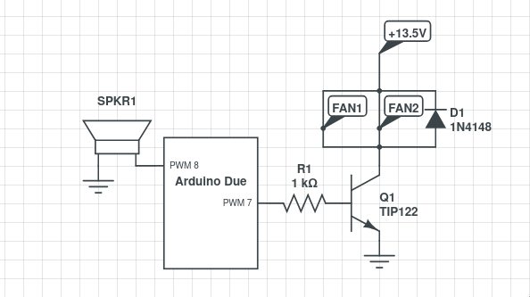
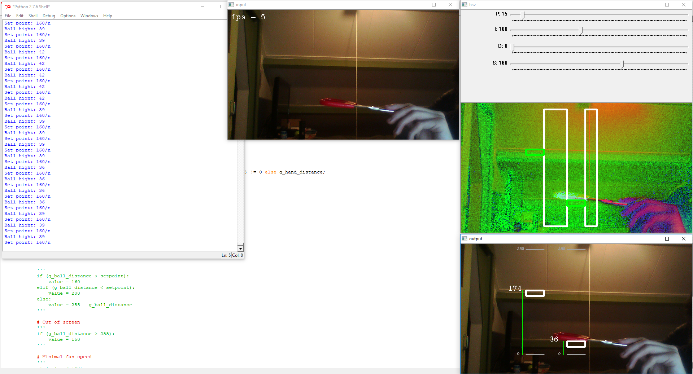

# MRB - Technical document
---

## Aansturing van fans en speaker
Voor het aansturen van de fans is een externe voeding gebruikt van 13.5 volt die maximaal 60 watt kan leveren. Dit is dus meer dan genoeg voor de twee fans.  
De stroom van de fans gaat via de transistor TIP122 naar de grond. Deze transistor wordt vanaf de Arduino aangestuurd doormiddel van PWM.  
De speaker gaat via een digitale pin die snel uit een aan gaat naar de grond. Hoe sneller het uit en aan gaan van deze pin, hoe hoger de toon van de speaker.

## Detecteren van bal en hand
Omdat voor het detecteren van de bal computer vision gebruikt moest worden, is er gekozen om het verzetten van de setpoint ook gebruik te laten maken van computer.
Hierdoor moest het detectie algoritme wel op zo manier geschreven worden dat er zowel een ping pong bal als een hand gedetecteerd kon worden.

Dit probleem is opgelost door een generiek algoritme te schrijven die op basis van kleur contrast objecten kan detecteren. Dit wordt gedaan met behulp van de opencv2 library in python. Met de library wordt de webcam van de laptop uitgelezen en beelden omgezet naar het hsv kleuren representatie model. Vervolgens wordt er binnen een gegeven rectangle  op de image (64 bij 324 voor de hand rectangle en 32 x 324 voor de bal) per rij gekeken naar de gemiddelde saturatie. Van deze gemiddelden worden de verschillen tussen de opeenvolgende gemiddelden berekend en als deze hoger zijn dan een gedefinieerde threshold wordt er een distance teruggegeven. Deze distance wordt in het geval van de hand gebruikt voor het instellen van een setpoint en in het geval van de bal gebruikt voor het berekenen van de error voor de PID regelaar. De setpoint wordt alleen aangepast wanneer deze niet handmatig is aangepast met behulp van de slider.

Om dit allemaal iets makkelijker te laten ogen worden er ook drie schermen aangemaakt.
Het eerste scherm genaamd “Input” is het scherm met daarop de directe output van de camerabeelden. Deze beelden zijn dus nog niet verwerkt. Op dit scherm worden ook het aantal frames per seconde van de applicatie getoond.
Het tweede scherm genaamd “hsv” is het scherm met de beelden van het input scherm omgezet naar het HSV kleuren representatie model. Op dit scherm worden ook de rectangles waarin gezocht wordt naar een hand en bal getoond, met daarbij een rectangle op de plek dat iets gevonden wordt. Er is ook een stuk code dat een histogram toond van de gemiddelde gemeten saturatiewaarden, dit is echter uitgecommentarieerd omdat het histogram van de eerste rectangle de tweede rectangle overlapte en hiermee dus over zich liet vervallen. Ook bevat dit scherm de sliders voor het instellen van de PID settings en de setpoint.
Het derde scherm genaamd “output” is het scherm met een nette weergave van de hoogtes van de gedetecteerde objecten binnen de rectangles, hierdoor is het makkelijk te ziet wat er waar er iets gedetecteerd wordt. De onderstaande afbeelding laat zien hoe de drie beelden er uit zien.

## PID regelaar
Het is de bedoeling dat de bal gebalanceerd wordt naast de gegeven setpoint, dit is gerealiseerd door middel van een PID regelaar. Voor het berekenen van de error wordt de setpoint van gemeten afstand van de bal afgetrokken. Deze berekende error wordt vervolgens vermenigvuldigd met kp voor de P van PID. Dezelfde error wordt vermenigvuldigt met de delta en opgeteld bij iterm. Iterm wordt daarna weer gebruikt om de vermenigvuldigen met Ki voor de I van het PID regelsysteem. Voor de D van het PID wordt de laatst gemeten error van de huidige error afgetrokken en gedeelt door de delta en keer kd gedaan.
Het PID gedeelte wordt berekend op dezelfde laptop die ook het computer vision deeld afgehandeld, de berekende waarde voor de motorsnelheid van de fans wordt vervolgens doorgestuurd naar de arduino.

## Communicatie tussen pc en arduino
Voor de communicatie tussen de pc en arduino is seriële communicatie gebruikt. Dit wordt aan de kant van de pc met behulp van de pySerial library gedaan in python en aan de kant van arduino met de standaard arduino IDE. Omdat de arduino zowel de data van de fan speed als die van de speaker toon nodig had is er een protocol opgesteld die er voor zorgt dat de goede data gebruikt wordt voor de goede doeleinden. Dit wordt gedaan door eerst een byte te sturen met de modus. Deze modus kan ‘M’ of ‘S’ zijn. Wanneer de mode op ‘M’ staat wordt de fan speed aangepast en wanneer de modus op ‘S’ staat wordt de speaker tone aangepast. De speaker toon is gebaseerd op de positie van de bal, hoe beter de PID regelaar dus werkt hoe stabieler de toon van de speaker is.
Omdat de pc ook druk bezig is met de computer vision is er gekozen om meerdere threads te gebruiken. Één voor de computer vision, één voor het luisteren naar seriële communicatie en één voor het versturen van seriële communicatie. Ondanks de pc luistert wordt er vanaf de arduino geen data verstuurd. Dit was niet langer nodig omdat het verzetten van de setpoint met behulp van computer vision wordt gedaan in plaats van een afstandsmeter.
